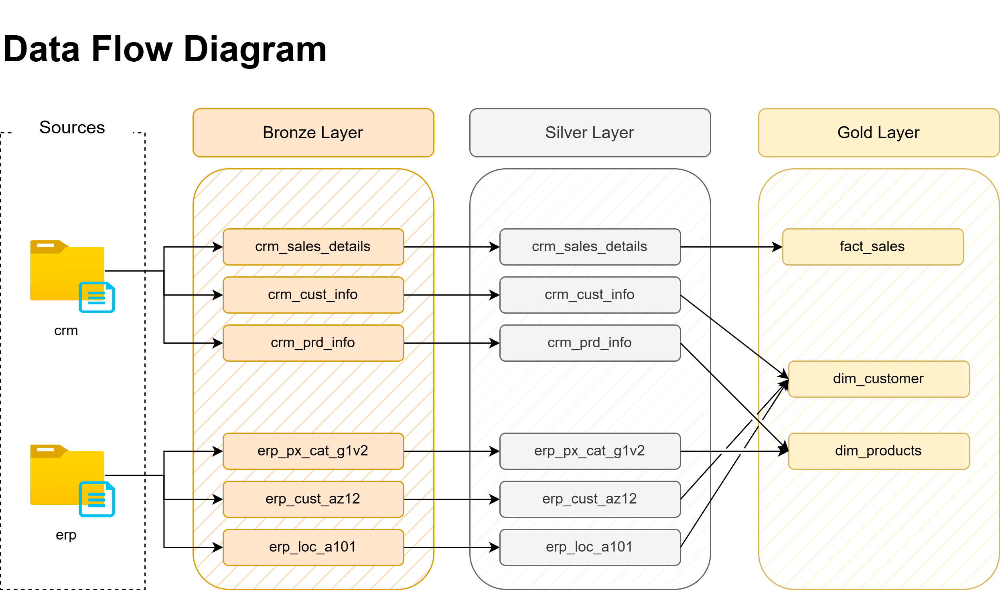
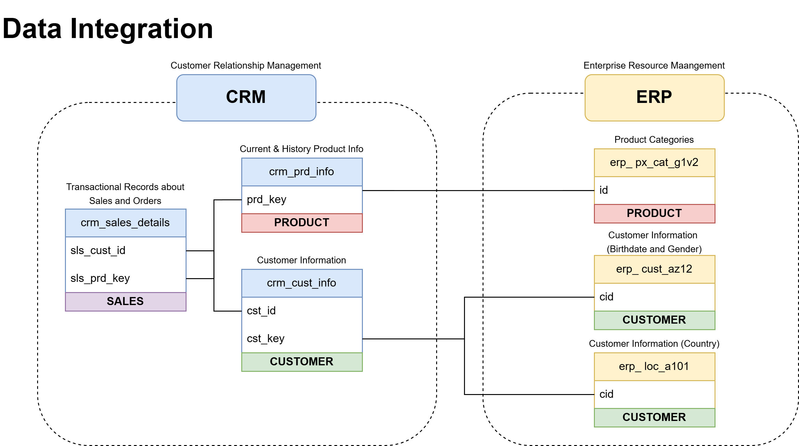
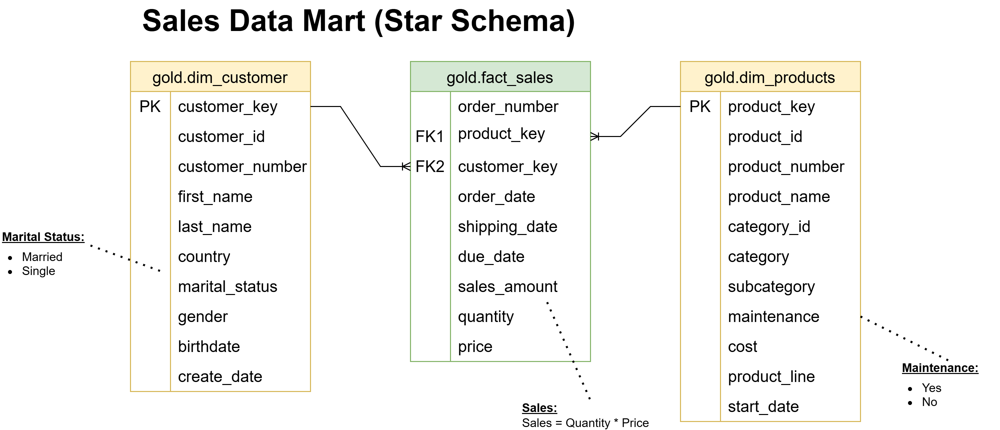

# Data Warehouse and Analytics Project

Welcome to the **Data Warehouse and Analytics Project repository!** 🚀
This project demonstrates a comprehensive data warehousing and analytics solution, from building a data warehouse to generating actionable insights. Designed as a portfolio project, it highlights industry best practices in data engineering and analytics.
A modern data warehouse with SQL Server, including ETL processes, data modelling, and analytics.

--- 

## **Table of Contents**

1. [Project Overview](#project-overview)
2. [Project Requirements](#project-requirements)
   - [Objective](#objective)
   - [Specfications](#specifications)
3. [Data Architecure](#data-architecture)
4. [Data Flow](#data-flow)
5. [Data Integration](#data-integration)
6. [Data Model](#data-model)
7. [Important Links and Tools](#important-links-and-tools)
8. [Repository Structure](#repository-structure)
9. [License](#license)
10. [About Me](#about-me)

---

## Project Overview

1. **Data Architecture** - Designing a data warehouse using the **Medallion Architecture** (Bronze, Silver, and Gold Layers).
2. **ETL Pipelines** - Extracting, Transforming, and Loading structured data into the Warehouse.
3. **Data Modeling** - Developing interconnected fact and dimension tables using the **Star Schema Data Model**, optimizing for querying and advanced analytics.
4. **Analytics & Reporting** - Creating SQL-based reports and dashboards for actionable insights.

---

## Project Requirements

#### Objective
Develop a modern data warehouse using SQL Server to consolidate sales data, enabling analytical reporting and informed decision-making.

#### Specifications
- **Data Sources**: Import data from two source systems (ERP and CRM) provided as CSV files.
- **Data Quality**: Cleanse and resolve data quality issues prior to analysis.
- **Integration**: Combine both sources into a single, user-friendly data model designed for analytical queries.
- **Scope**: Focus on the latest dataset only; historization of data is not required.
- **Documentation**: Provide clear documentation of the data model to support both business stakeholders and analytics teams.

---

## Data Architecture 
The data architecture for this project follows the **Medallion Architecture** (Multi-hop Architecture), which consists of the **bronze**, **silver**, and **gold** layers. This type of structure involves making incremental improvements to the data quality as it flows through each layer of the architecture. The setup for this project is shown below:


**Bronze Layer:** 🥉
- The raw data is stored as-is from the source systems.
- Data is extracted from the CSV files (source object type) into the SQL Server database.

**Silver Layer:** 🥈
- Includes data cleansing, standardization, and normalization processes.
- Preparation phase prior to data analysis.

**Gold Layer:** 🥇
- Holds all of the business-ready data modelled into a star schema for reporting and analytics.

---

## Data Flow


The diagram above shows the path the data takes moving from the source folder to the gold layer, where business-ready data can be used for visualization and analysis. Note that most of the rearrangement occurs between the silver and gold layers, where the data model is created through fact/dimension categorization and grouping. More on this topic below.

## Data Integration


The diagram above shows all the relationships discovered between the data tables. The tables in the CRM group can be tied to the tables in the ERP group (e.g., the *prd_key* column from the *crm_prd_info* has a close relationship to the *id* column from the *erp_px_cat_g1v2* table).

## Data Model


As shown from the **Star Schema Model**, the data is separated into two dimension groups (customers and products tables) and one fact group (sales table). A **surrogate key** is used for each of the dimension tables. These tables have a **one-to-many relationship** with the master fact table (gold.fact_sales).

## Important Links and Tools 

- **[Dataset](/datasets/):** Access to the project files (CSV format).
- **[SQL Server Express](https://www.microsoft.com/en-us/sql-server/sql-server-downloads):** Server to host the SQL database.
- **[SQL Server Management Studio (SSMS)](https://learn.microsoft.com/en-us/ssms/download-sql-server-management-studio-ssms?view=sql-server-ver16):** GUI used for managing and interacting with the database.
- **[GitHub](https://github.com/):** Storage for all files, queries, and related project documents.
- **[Draw.io](https://www.drawio.com/):** Designing data architecture, flow/integration diagrams, and other visuals.
- **[Notion Page](https://www.notion.com/):** Project Planning and Management Tool. Click **[here](https://www.notion.so/Data-Warehousing-Project-1a247ae651ed804cae3fcc4d00a67878?pvs=4)** to access the Project Plan.

---

## Repository Structure
```
data-warehouse-project/
│
├── datasets/                           # Raw datasets used for the project (ERP and CRM data)
│
├── documents/                          # Project documentation and architecture details
│   ├── data_architecture.drawio        # Draw.io file displaying the project architecture
│   ├── data_catalog.md                 # Catalog of datasets, including field descriptions and metadata
│   ├── data_flow_diagram.drawio        # Draw.io file for the data flow diagram
│   ├── data_model.drawio               # Draw.io file for data models (star schema)
│   ├── naming-conventions.md           # Consistent naming guidelines for tables, columns, and files
│
├── scripts/                            # SQL scripts for ETL and transformations
│   ├── bronze/                         # Scripts for extracting and loading raw data
│   ├── silver/                         # Scripts for cleaning and transforming data
│   ├── gold/                           # Scripts for creating analytical models
│
├── tests/                              # Test scripts and quality files
│
├── README.md                           # Project overview and instructions
└── LICENSE                             # License information for the repository
```

---

## License

This project is licensed under the [MIT License](LICENSE). You are free to use, modify, and share this project with proper attribution.

---

## About Me

Hi there! I'm **Lucas Chung**. I’m an engineer on a mission to work in the world of data analytics. If you found this project interesting, feel free to take a look at my other work from my portfolio here on **[GitHub](https://github.com/lucashlc822)**.

Let's stay in touch! Feel free to connect with me on **[LinkedIn](https://www.linkedin.com/in/lucashlc/)**.


