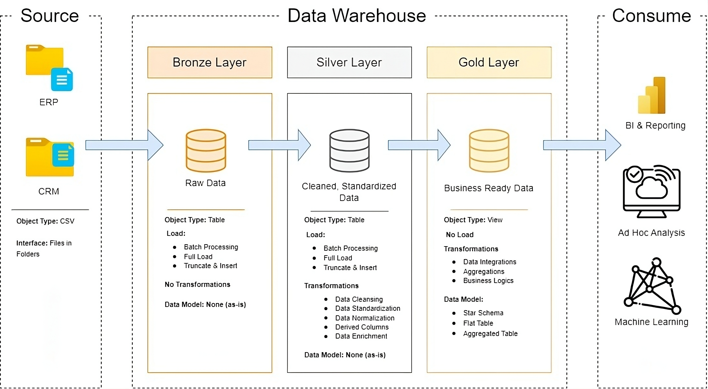

# Data Warehouse and Analytics Project

Welcome to the **Data Warehouse and Analytics Project repository!** 🚀
This project demonstrates a comprehensive data warehousing and analytics solution, from building a data warehouse to generating actionable insights. Designed as a portfolio project, it highlights industry best practices in data engineering and analytics.
A modern data warehouse with SQL Server, including ETL processes, data modelling, and analytics.

---

## Data Architecture
The data architecture for this project follows the **Medallion Architecture** (Multi-hop Architecture), which consists of the **bronze**, **silver**, and **gold** layers. This type of structure involves making incremental improvements to the data quality as it flows through each layer of the architecture.

